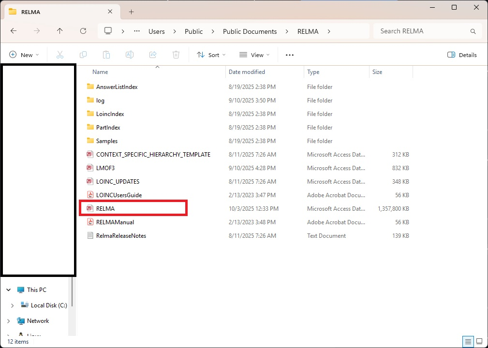
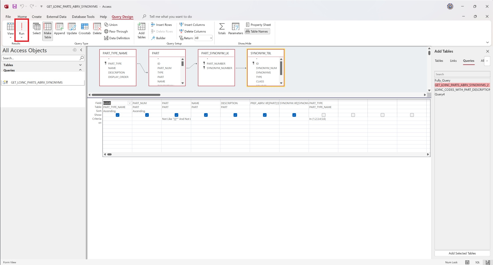
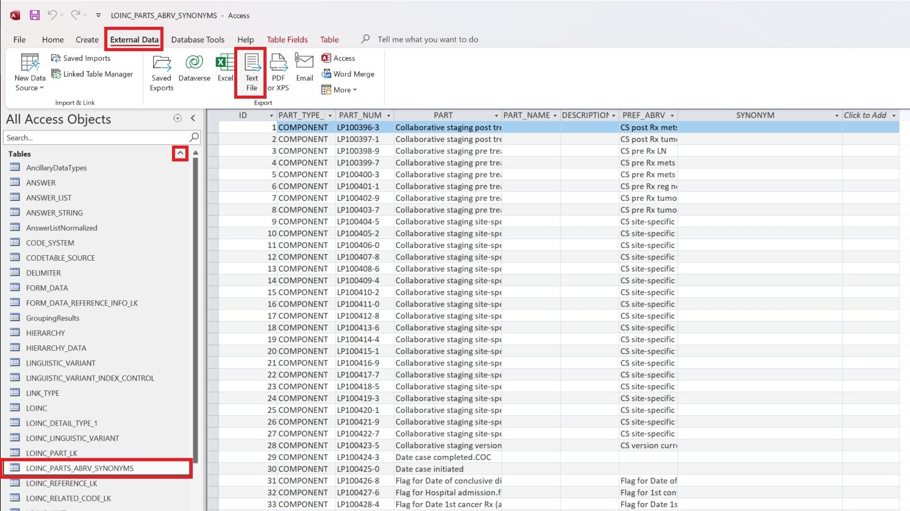
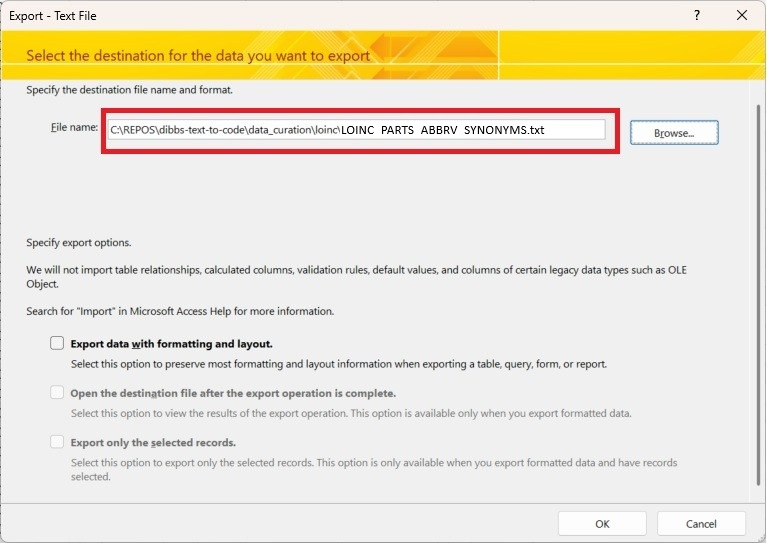
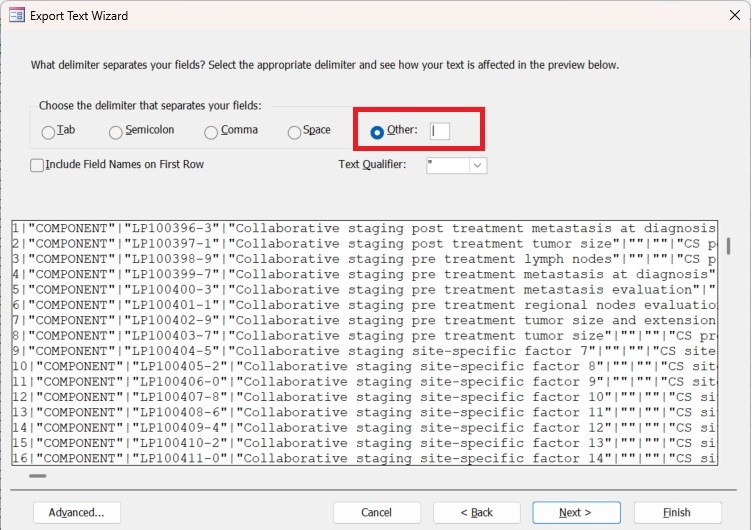
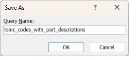
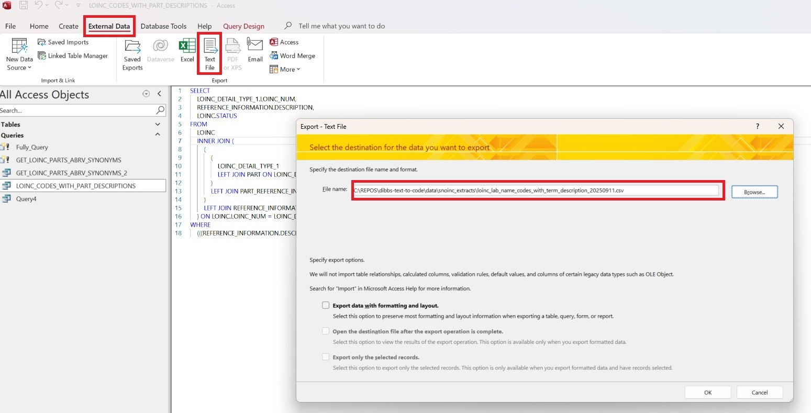

# DIBBS Text to Code (TTC) - Data Curation

## Table of Contents

- [Overview](#overview)
- [Scripts](#scripts)
- [Data Files](#data-files)
   - [LOINC](#loinc)
   - [LOINC Part Synonyms & Abbreviations](#loinc-part-synonyms-&-abbreviations)
   - [LOINC Part Descriptions](#loinc-part-descriptions)
   - [LOINC UMLS Related Names](#loinc-umls-related-names)
   - [SNOMED](#snomed)
   - [HL7](#hl7)
- [Instructions](#instructions)
   - [Generating SNOINC Extracts](#generating-snoinc-extracts)
     - [Dependencies](#dependencies)
     - [Command Line](#command-line)
     - [Direct Relma DB Queries](#direct-relma-db-queries)

## Overview

The `data_curation` folder contains scripts for TTC model development, tuning, and evaluation.  Most of the scripts leverage data that is being pulled from the LOINC, UMLS, and HL7 APIs.  However, some require the LOINC RelmaDB (MS-Access database).

## Scripts

### terminology_valueset_sync.py

Contains various functions to pull data from SNOMED, LOINC, and HL7 APIs to provide data for the TTC model. For detailed instructions on how to use the various scripts [see instruction section below](#command-line)

### augmentation.py

A collection of data modification utilities for terminology datasets, designed to support model training and tuning.

This module provides functions to introduce controlled randomness into text data by:
   - Randomly scrambling words or characters
   - Randomly deleting characters
   - Randomly replacing words with related or synonymous terms  

These transformations are useful for creating augmented datasets that improve model robustness and generalization, particularly when dealing with noisy or variant terminology (e.g., clinical terms, lab names, or LOINC entries).

All randomization behaviors and transformation parameters are configurable via the `configs.py` module, allowing users to fine-tune augmentation intensity, probability distributions, and substitution rules.

### configs.py

A collection of various configurations used to augment data and/or create synthetic data, using the terminology data sets.

### generation.py

A script to house functions that can be used to generate data sets used to help train and tune the data models.  ie. `Generate Positive Pairs` - Given the location of one or more files of LOINC codes and some corresponding augmented examples for those codes, this function compiles a list of positive pairs that can be read for model training. A positive pair is a tuple of the form (original_loinc_code, augmented_example_of_code).

### synthetic_lab_results.py

Generate a CSV of synthetic lab results with labeled values. Each row contains a randomized result word (e.g., "positive", "not detected")
and a label: 1 for positive terms, 2 for negative terms. Optionally, the cript can introduce randomized case changes and typos.

### loinc (folder)

Contains .sql queries/files that are used to gather data from LOINC's RELMA database (MS-Access), as well as the resulting data files that are used to generate some of the data files.


## Data Files

### LOINC:

These data files are for the Lab codes/concepts in LOINC for the base TTC model.

#### Data Structure:

```csv
code|short_name|long_name|display_name|definition_desc|related_names
110636-8|APAP Msmt Ur|Acetaminophen [Measurement] in Urine|Acetaminophen (U) [Measurement]||ACET; Acetamidophenol; Acetaminoph; Acetominophen; APAP; c209; C55; Hydroxyacetanilide; Lab orders; Msmt; N-(4-Hydroxyphenyl)acetanilide; N-Acetyl-p-aminophenol; p-Acetamidophenol; Paracetamol; p-Hydroxyacetanilide; Tylenol; u209; UA; UR; Urn
53781-1|Acetamin+Propoxyph Pnl Ur-mCnc|Acetaminophen and Propoxyphene panel [Mass/volume] - Urine|Acetaminophen and Propoxyphene panel (U) [Mass/Vol]||ACET; Acetamidophenol; Acetamin+Propoxyph Pnl; Acetaminoph; Acetominophen; Algaphan; APAP; c209; C55; Cosalgesic; Cotonal-65; Darvocet; Darvon; Depronal; Dextrogesic; Dextropropoxyphene; Distalgesic; Dolasan; Doloxene; D-propoxyphene; DRUG/TOXICOLOGY; Drugs; Hydroxyacetanilide; Level; Mass concentration; N-(4-Hydroxyphenyl)acetanilide; N-Acetyl-p-aminophenol; Napsalgesic; p-Acetamidophenol; Pan; PANEL.DRUG & TOXICOLOGY; Panl; Paracetamol; p-Hydroxyacetanilide; Pnl; Point in time; Propoxyph pnl; QNT; Quan; Quant; Quantitative; Random; Tylenol; u209; UA; UR; Urn

```
- Code: A unique identifier for a specific test or observation, typically in a 5-digit-then-a-dash format (e.g., 806-0). 
- Short Name: A concise name used for quick displays, such as in a report's column header. 
- Long Name (Long Common Name): A more readable, expanded version of the LOINC concept, created to be user-friendly for clinicians. 
- Display Name: A flexible field that can be the Long Common Name, Short Name, or another name for the term, depending on how the user or system wants to present it. 
- Definition Description (Fully-Specified Name): The formal, six-part description that provides the complete and standardized meaning of the observation. 
- Related Names: This category can include various other terms or synonyms used to describe the same test or observation, helping to map local codes to the LOINC standard. List of terms is `;` delimited.

#### Extracts

- [Lab Orders](../data/snoinc_extracts/loinc_lab_orders_20250926.csv) - LOINC provides codes that represent the specific clinical concept of the test being ordered, or in other words a request made to a laboratory to perform a specific test or panel of tests.   In HL7v2 this would be the equivalent of an OBR.   

- [Lab Results](../data/snoinc_extracts/loinc_lab_result_20250926.csv) - The LOINC code identifies the performed test, the actual information or observation that comes back from the laboratory after the order has been fulfilled, and is combined with a result value and unit of measure (See other valuesets for more information) to form the complete lab result.   In HL7v2 this would be the equivalent of an OBX.
   
- [Lab Names](../data/snoinc_extracts/loinc_lab_names_20250926.csv) - The LOINC codes and terms for both Lab Orders and Lab Results in a single set.  This is primarily used to satisfy the models used for determining the correct code for Lab Orders and Resulting Labs in TTC.

---

### LOINC Part Synonyms & Abbreviations

These data files are organizing all the possible abbreviations and synonyms for all the particular LOINC Part codes/concepts into a single JSON/Dictionary file.

LOINC terms are comprised of six parts, defining a specific clinical observation or measurement: Component (the analyte), Property (the characteristic being measured), Time Aspect (when it was measured), System (the specimen or source), Scale (how the result is expressed), and Method (how it was measured). These parts, joined by colons, create a fully specified name that provides clarity and standardization for clinical data exchange.  

#### Extracts

Each part provides unique information about the test or observation: 
- [Component](../data/snoinc_extracts/loinc_component_abbrv_syn_20250926.json): What is being measured (e.g., glucose, a specific organ part). 
- [Property](../data/snoinc_extracts/loinc_property_abbrv_syn_20250926.json): The specific attribute of the component being measured (e.g., length, mass, number). 
- [Time Aspect](../data/snoinc_extracts/loinc_time_abbrv_syn_20250926.json): The time frame or duration over which the measurement was made. 
- [System](../data/snoinc_extracts/loinc_system_abbrv_syn_20250926.json): The specimen source or origin of the measurement (e.g., serum, plasma, blood). 
- [Scale](../data/snoinc_extracts/loinc_scale_abbrv_syn_20250926.json): How the result is reported (e.g., quantitative for numbers, ordinal for ranked categories, narrative for text). 
- [Method](../data/snoinc_extracts/loinc_method_abbrv_syn_20250926.json): The technique or procedure used to perform the measurement. This part is the only one that is not mandatory for every LOINC term. 

#### Data Structure:

```json
{
   ...
   "Clinical biochemical genetics": {
        "code": "LP134112-4",
        "abbrv": [
            "Clinic biochem gen"
        ],
        "synonyms": [
            "Medical biochemical genomics",
            "Clinical biochem genetics",
            "Medical biochemical genetics",
            "Clinical biochemical genomics"
        ]
    },
    ...
}
```
- Key: LOINC Part Short Name
- Code: The LOINC Part unique identifier, starting with LP then typically in a 6-digit-then-a-dash format (e.g., LP806123-0).
- Abbrv: A list of abbreviations for the specific LOINC Part.
- Synonym: A list of synonyms for the specific LOINC Part.

---

### LOINC Part Descriptions

This is a data file that contains LOINC codes/concepts that also have a LOINC Part descriptions that give a more in-depth description of the LOINC Lab code/concept.  Not all LOINC codes/concepts will have a result in this data file.  A custom [sql query](./loinc/loinc_codes_with_part_descriptions.sql) was created to extract this data from the LOINC RELMA database, as the results weren't possible to be extracted using the LOINC API.

#### Data Structure:

```csv
LOINC_NUM,DESCRIPTION
21019-5,Metanephrine is a metabolite generated when epiniphrine is cleaved by catechol O-methyltransferase. It is also known as 4-hydroxy-3-methoxy-alpha-((methylamino)methyl) benzenemethanol with formula C10-H15-N-O3.
80974-9,"Sulfamethoxazole is a sulfonamide bacteriostatic antibiotic. It is most often used as part of a synergistic combination with trimethoprim in a 5:1 ratio in co-trimoxazole, which is also known as Bactrim or Septrin. It can be used as an alternative to amoxicillin -based antibiotics to treat sinusitis. Mechanism of action:Sulfonamides are structural anologs and competitive antagonists of para-aminobenzoic acid (PABA). They inhibit normal bacterial utilization of PABA for the synthesis of folic acid, an important metabolite in DNA synthesis. The effects seen are usually bacteriostatic in nature. Folic acid is not synthesized in humans, but is instead a dietary requirement. This allows for the selective toxicity to bacterial cells (or any cell dependent on synthesizing folic acid) over human cells."
```
- LOINC_NUM: A unique identifier for a specific test or observation, typically in a 5-digit-then-a-dash format (e.g., 806-0).
- DESCRIPTION: The description pulled for the 'Component Core' Part for correlating LOINC codes/concept.

#### Extracts:

- [LOINC Codes with Part Descriptions](../data/snoinc_extracts/loinc_codes_with_part_descriptions.csv)

_**NOTE: we can easily change this to be a file with any delimiter instead of a comma (`,`)**_

---

### LOINC UMLS Related Names

This data file organizes correlated terms from LOINC and other terminology sets, such as SNOMED, that correlate to a single LOINC code.  The UMLS `Atom` and `Crosswalk` APIs are leveraged to gather and organize this data.

#### Data Structure:

```json
{
   ...
    "Epidermal Allergen Mix (Dog dander+Cat epithelium+Horse dander) Ab.IgE panel - Serum or Plasma": {
        "code": "102115-3",
        "names": [
            "(Dog dander+Cat epithelium+Horse dander) Antibody.immunoglobulin E panel:-:To identify measures at a point in time:Serum/Plasma:-",
            "Epid Allerg Mix IgE pl SerPl",
            "(Dog dander+Cat epithelium+Horse dander) IgE pl",
            "(Dog dander+Cat epithelium+Horse dander) Ab.IgE panel:-:Pt:Ser/Plas:-"
        ]
    },
    ...
}
```
- key: LOINC Full Common Name
- code: A unique identifier for a specific test or observation, typically in a 5-digit-then-a-dash format (e.g., 806-0).
- names: A list of all related terms/names from the `atom` and `crosswalk` APIs for the LOINC Code.

#### Extracts

- [Loinc UMLS Related Names](../data/snoinc_extracts/loinc_umls_related_names_20250929.json)

---

### SNOMED

These data files are for the various codes/concepts in SNOMED used to be the base of the TTC model.

#### Data Structure:

 ```csv
 code|text
442779003|Borderline low
281301001|Within reference range
 ```
- code: These are unique numerical identifiers for clinical concepts, such as a specific disease, a symptom, or a procedure.
- text: Each concept code is associated with one or more textual descriptions that human-readable terms for the concept. A concept can have several descriptions, including synonyms, which represent the same clinical idea.  For this data file there will just be a single text, the common name/term/description, associated with each code.

#### Extracts:

- [Lab Values](../data/snoinc_extracts/snomed_lab_value_20250926.csv) - SNOMED CT does not code the specific quantitative values of lab results (e.g., "glucose 105 mg/dL") but rather provides codes for the qualitative interpretation of a result (e.g., positive, negative, abnormal). The quantitative value and its units are typically stored separately in the health record. 

---

### HL7

These data files are for the various codes & displays from various HL7 ValueSets and CodeSystems used in the base of the TTC model.

#### Data Structure:

```csv
code|text
B|Better
D|Significant change down
```
- Code: The unique machine-readable identifier for a concept.
- Text: Human-readable text describing the concept.

#### Extracts:

- [Lab Interpretations](../data/snoinc_extracts/hl7_lab_interp_20250926.csv) - In an HL7 message, the value from the ObservationInterpretation code system and/or a value set derived from it is used to provide additional context to the reported lab result. For instance, alongside a quantitative lab value, an interpretation code might indicate whether the result is "High" or "Low". This helps clinicians understand the significance of a result without having to interpret raw data themselves. 

## Instructions

### Generating SNOINC Extracts

:warning: **NOTE: this process to generate these extracts will pull from the latest data from LOINC and SNOMED.  A process to "Update" these extracts has not been created yet** :warning:

#### Dependencies

- [LOINC Regenstrief Account](https://loinc.org/join/) - Sign up to create a LOINC User Account
   - Store your newly created LOINC Username in an environment variable: `LOINC_USERNAME`
   - Store your newly created LOINC Password in an environment variable: `LOINC_PWD`

- [Download LOINC Relma](https://loinc.org/file-access/download-id/8763/)
   - Locate and remember where the Relma.mdb database is (Typically located: `C:<path_to_relma_installation>\RELMA\RELMA.MDB`)

- [UMLS Terminology Service Account](https://uts.nlm.nih.gov/uts/signup-login) - Sign up and to get a UMLS Metathesaurus License
   - Once you get your UMLS API Key store in it an environment variable: `UMLS_API_KEY`

---

#### Command Line

There are a handful of CLI commands you can use to generate the extract files.  Here are the instructions you can use to get the various files.

- **HELP**
   - In a terminal at the base of the dibbs-text-to-code repo, navigate to the data_curation folder `cd data_curation`
   - enter `python .\terminology_valueset_sync.py --help`


---

- [**Lab Orders**](#loinc)
   - In a terminal at the base of the dibbs-text-to-code repo, navigate to the data_curation folder `cd data_curation`
   - Make sure your loinc username and password are [set as environment variables](#dependencies)
   - Enter `python .\terminology_valueset_sync.py --lab_orders`
   - A file named loinc_lab_orders_<current date (YYYYMMDD)>.csv will be created in the [data folder](../data/)

---

- [**Lab Observations**](#loinc)
   - In a terminal at the base of the dibbs-text-to-code repo, navigate to the data_curation folder `cd data_curation`
   - Make sure your loinc username and password are [set as environment variables](#dependencies)
   - Enter `python .\terminology_valueset_sync.py --lab_obs`
   - A file named loinc_lab_result_<current date (YYYYMMDD)>.csv will be created in the [data folder](../data/)

---

- [**Lab Names**](#loinc) (All Labs for both Orders and Observations)
   - In a terminal at the base of the dibbs-text-to-code repo, navigate to the data_curation folder `cd data_curation`
   - Make sure your loinc username and password are [set as environment variables](#dependencies)
   - Enter `python .\terminology_valueset_sync.py --lab_names`
   - A file named loinc_lab_names_<current date (YYYYMMDD)>.csv will be created in the [data folder](../data/)

---

- [**Lab Result Values**](#snomed)
   - In a terminal at the base of the dibbs-text-to-code repo, navigate to the data_curation folder `cd data_curation`
   - Make sure your UMLS API Key is [set as an environment variable](#dependencies)
   - Enter `python .\terminology_valueset_sync.py --lab_values`
   - A file named snomed_lab_values_<current date (YYYYMMDD)>.csv will be created in the [data folder](../data/)

---

- [**Lab Interpretations**](#hl7)
   - In a terminal at the base of the dibbs-text-to-code repo, navigate to the data_curation folder `cd data_curation`
   - Enter `python .\terminology_valueset_sync.py --lab_interp`
   - A file named hl7_lab_interp_<current date (YYYYMMDD)>.csv will be created in the [data folder](../data/)
   
---

- [**Loinc Abbreviations & Synonyms**](#loinc-part-synonyms--abbreviations)
   - Make sure you have download the [LOINC Relma database](#dependencies) and have located it
   - Open the Relma.mdb file
   
   - Select the `Create` Option in the Menu and then select `SQL Query`
   
   - Open the SQL query provided for [loinc parts abbreviations & synonyms](./loinc/get_loinc_parts_abbrv_synonyms.sql) and copy the contents of that file into the newly created query.
   
   - Before saving the query, select the `Make Table` option for the `Query Type` and enter the "Table Name" as `LOINC_PARTS_ABBRV_SYNONYMS` and then click `OK`
   
   - Click on Save in the top right corner and name the query: `GET_LOINC_PARTS_ABBRV_SYNONYMS`
   - With the query still open in "Design" mode click on the `Run` Button at the top of the menu.  This will create the table using the data from the query.
   
   - Find the newly created table by expanding the '^' option next to `Tables` in the right hand menu.  Select the `LOINC_PARTS_ABBRV_SYNONYMS` table from the list and then select `External Data` in the menu up-top.  Then click on the `Text File` as the "Export" option.
   
   - Ensure to save the file, with the same table name `LOINC_PARTS_ABBRV_SYNONYMS.txt`, to the following location: `C:\<your repo location>\data_curation\loinc` and then click `OK`.
   
   - When the "Export Text Wizard" appears select `Delimited` and click `Next`
   
   - Choose the `Other` option and enter a `|` in the box and click `Next`.  And then `Finish` on the next screen.
   
   - This will save the necessary data in a file within the repo that will be used to generate the LOINC Part Abbreviation Files.
   - In a terminal at the base of the dibbs-text-to-code repo, navigate to the data_curation folder `cd data_curation`
   - Enter `python .\terminology_valueset_sync.py --loinc_abbr_syn`
   - Several files with a similar pattern for all the different LOINC Parts: loinc_<part>_abbrv_syn_<current date (YYYYMMDD)>.json will be created in the [data folder](../data/)

---

- [**Loinc Lab UMLS Related Names**](#loinc-umls-related-names)
   - In a terminal at the base of the dibbs-text-to-code repo, navigate to the data_curation folder `cd data_curation`
   - Enter `python .\terminology_valueset_sync.py --loinc_umls_syn`
   - A file named loinc_umls_related_names_<current date (YYYYMMDD)>.json will be created in the [data folder](../data/)

   :warning: **NOTE: This will take approximately 36 hours to complete, but if you stop it or you receive an error, you can restart this process and it will pick up where it left off** :warning:

---

- **All Extracts**
   - Ensure that all [dependencies](#dependencies) are handled
   - In a terminal at the base of the dibbs-text-to-code repo, navigate to the data_curation folder `cd data_curation`
   - Enter `python .\terminology_valueset_sync.py --all`
   - All processes for the various extracts, listed above, will run created all subsequent files in the [data folder](../data/)
   
---

#### Direct Relma DB Queries

- [**Loinc Codes With Core Component Descriptions**](#loinc-part-descriptions)
   - Make sure you have download the [LOINC Relma database](#dependencies) and have located it
   - Open the Relma.mdb file
   
   - Select the `Create` Option in the Menu and then select `SQL Query`
   
   - Open the SQL query provided for [loinc codes with part descriptions](./loinc/loinc_codes_with_part_descriptions.sql) and copy the contents of that file into the newly created query.  Then select the save button at the top left.
   - Enter a name for the query and click on `OK`\
   
   - With the newly created query still open, select `External Data` in the menu up-top.  Then click on the `Text File` as the "Export" option. Ensure to save the file, with the name `loinc_lab_name_codes_with_term_description_<current date (YYYYMMDD)>.csv`, to the following location: `C:\<your repo location>\data\` and then click `OK`.
   
   - Ensure to save the file, with the same table name `LOINC_PARTS_ABBRV_SYNONYMS.txt`, to the following location: `C:\<your repo location>\data_curation\loinc` and then click `OK`.
   - When the "Export Text Wizard" appears select `Finish`.
   - This will save the query results in the [data folder](../data/)

---
