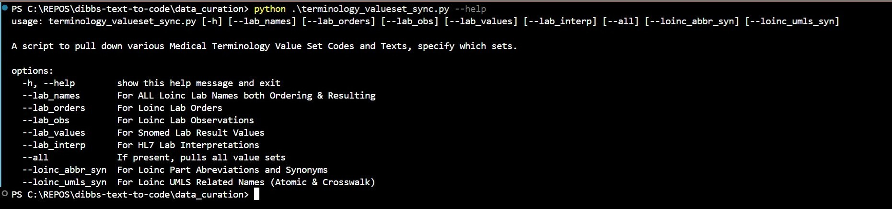
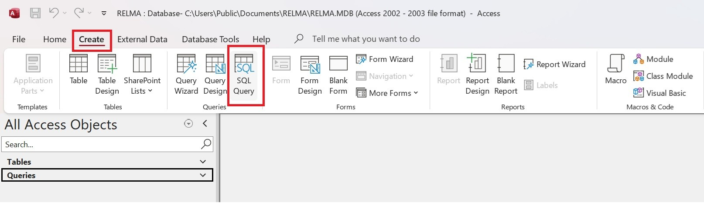
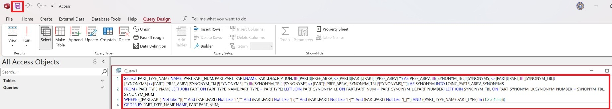
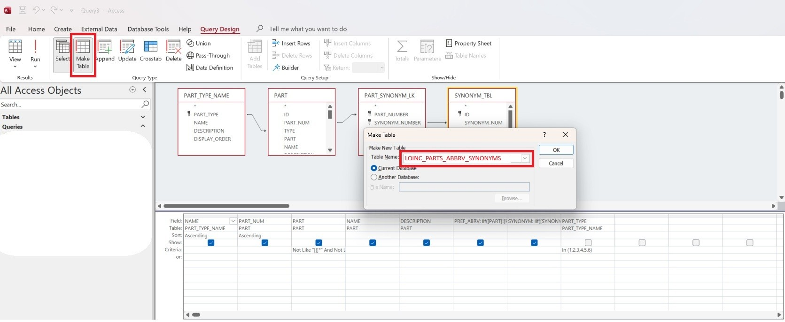
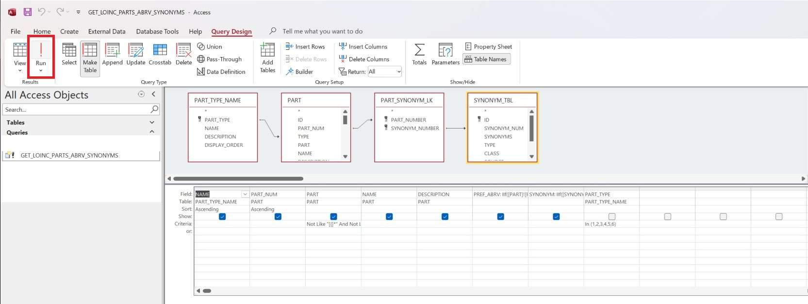
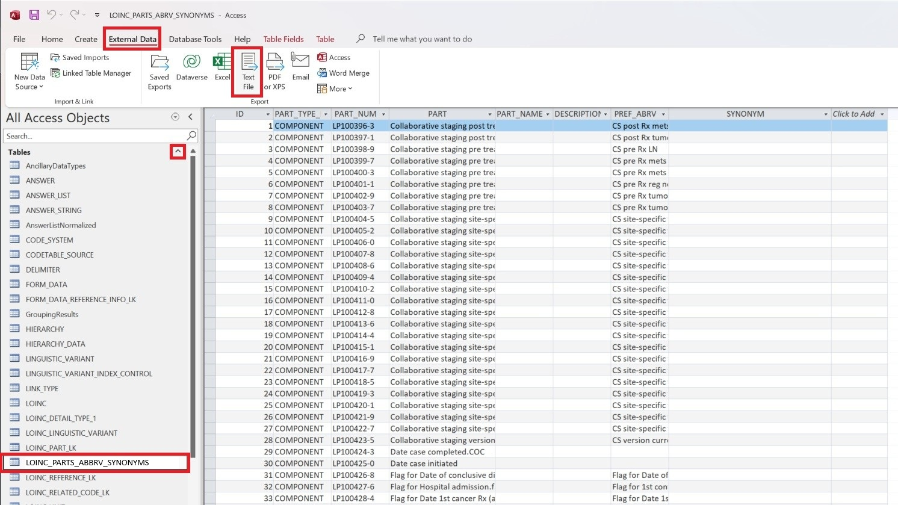
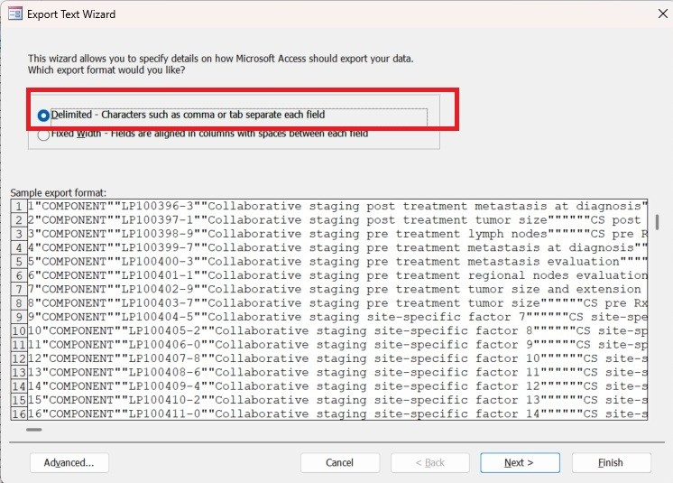

# DIBBS Text to Code (TTC) - Data Curation

## Table of Contents

- [Overview](#overview)
- [Scripts](#scripts)
- [Deprecated Scripts](#deprecated-scripts)
- [Data Files](#data-files)
  - [LOINC](#loinc)
  - [LOINC Part Synonyms & Abbreviations](#loinc-part-synonyms-&-abbreviations)
  - [LOINC Part Descriptions](#loinc-part-descriptions)
  - [LOINC UMLS Related Names](#loinc-umls-related-names)
  - [SNOMED](#snomed)
  - [HL7](#hl7)
  - [VSAC](#vsac-value-set-authority-center)
- [Instructions](#instructions)
  - [Generating SNOINC Extracts](#generating-snoinc-extracts)
    - [Dependencies](#dependencies)
    - [Command Line](#command-line)
    - [Direct Relma DB Queries](#direct-relma-db-queries)

## Overview

The `data_curation` folder contains scripts dedicated to collecting and combining various LOINC data into formats suitable for model development, tuning, and evaluation. Most of the scripts leverage data that is being pulled from the LOINC, UMLS, and HL7 APIs. However, some require the LOINC RelmaDB (MS-Access database).

The TTC team built the synthetic data it uses for model development over two attempts. In the first attempt, "Synthetic Augmentation," we used heuristics created from studying research papers on medical ontology standardization to create "pseudorandom" synthetic examples. These variants had lots of random deletions, word order swaps, and word substitutions (the "Augmentation" in the name of this phase refers to supplementing and varying the semantic content of a LOINC code to create what was nominally a richer example). However, once we studied excerpts of production data, we realized these heuristics were extremely unrepresentative of the way data was non-uniform in reality. Synthetically Augmented data was frequently too short (due to missing words and characters) or too long (due to inserting semantically similar words without removing existing equivalents), and didn't match the type of structures we frequently saw in production data (i.e. Synthetically Augmented examples frequently had multiple repetitions of the same concept, whereas production data typically had _less_ information that _implied_ a particular concept).

This led to our second attempt, "Production Emulation." During this phase, we created a systematic set of "variation rules" that allowed us to manipulate our synthetic data with more awareness of context and structure. These included formulas for how to build LOINC codes derived from studying frequently occuring patterns, as well as common ways labs send variant parts of the LOINC axes.

The files in this package are divided by attempt. All of our Synthetic Augmentation code has been deprecated since the development of our Production Emulation scripts, and we have stored the files from our first phase in the `archive/` directory. More information about these files can be found in the [Deprecated Scripts](#deprecated-scripts) section of this README, below the section for our current working scripts. All files outside of this `archive/` directory are current, working files the TTC team is using.

## Scripts

### data_emulation.py

This is the main synthetic data generation script for TTC data creation Phase 2 ("Production Emulation"). The file is complex and is heavily documented, so for most details, we recommend looking at the file directly. However, the general workflow of the script is as follows:

For each LOINC code in a specified LOINC data file (containing name variants for LOINC codes as well as various attributes like LOINC axes and Lab Types):

- Construct a `LOINC_STRUCT` object out of the code to standardize and systematize its properties for use in the rest of the script.
- Process each name variant for the code (Long Common Name, Short Name, etc.) iteratively, applying different procedures depending on the variant in question (in most cases, Consumer Name is excluded due to non-uniqueness across LOINC codes).
- For Short Names and Fully-Specified Names, apply a small set of format-based rules to generate context-aware variants using colons, dashes, and other delimiters that help specify the key component of the LOINC code.
- For Display Names, apply a more rigorous set of "Variation Rules" on different parts of the code string, using patterns extracted from production data to create semantically equivalent but structurally different versions of the code (e.g. with the Testing Modality moved or truncated; with the Component axis abbreviated or replaced by an equivalent Related Name; with parenthetical abbreviations inserted or removed; with Measurement words indicating scale or ordinal quantification used in place of testing methods proper; etc.).
- For Long Common Names, apply the above Variation Rules in addition to a set of specific "Direct Build Formulas." These Formulas provide several ways to construct structurally varied LOINC codes directly out of the LOINC attribute axes and Related Names, and we observed many instances of production data that used these in place of standard codes.
- When each name variant has been processed and synthetic candidates created, apply a small amount of post-processing to the examples to make them increasingly distinct (e.g. changing conjunction delimiters; denoting tests as "Point-of-Care" POC; truncating long strings; etc.).
- Write the variants and their corresponding original string into a file as a set of positive pairs for model tuning.

For specific details on any of these points, see the script itself.

---

### loinc_enhancement.py

This script contains the code needed to perform Enhancements on various parts of LOINC codes. For the purposes of synthetic data generation, "Enhancement" refers to the process of substituting an acronym, abbreviation, or semantically similar/related word for all or part of a LOINC code string (e.g. replacing "Red Blood Cells" with "RBC," or substituting "Fenpat" for "Fentanyl"). Enhancement works by combining LOINC Related Names and Attribute Axes extracted from the LOINC API and supplemented with the RELMA Database into a single, searchable dictionary whose keys are commonly occuring phrases in the LOINC ontology.

LOINC Enhancement is a five step procedure documented more concretely in the script itself, but follows this approach:

- Determine all possible combinations of adjacent words in the LOINC code string, including singleton words
- Filter these combinations to only include candidates which are keys in the LOINC Enhancement dictionary
- Construct a list of "maximally disjoint" candidates, which are the longest candidates that include particular substrings (for example, "Ur" is a candidate in the enhancement dictionary, but so is its larger parent "Urine," of which it is an abbreviation; in this case, we want to keep "Urine" as a candidate but not "Ur" because this would leave three letters on the table)
- Determine the maximum number of enhancements that can be performed with this set of disjoint candidates
- For each enhancement, choose a dictionary replacement and apply it to the code string

The resulting code string is returned for further processing in other data generation tasks.

---

### loinc_utils.py

This script contains a number of simple helper functions designed to streamline synthetic data generation. They are all small in scale and involve identifying different parts of a LOINC code string (such as the modality), textually manipulating pieces of a string (scrambling word order, identifying parenthetical and bracket chunks), and combining different pieces of LOINC information for a larger function to make more complex variations.

---

### post_process.py

This script contains a number of small post-processing functions that can be applied individually or sequentially to synthetically-generated LOINC code strings. Post-processing differs from generating Variations on LOINC names in its scale: each post-processing function is small in scope and corresponds to a change that could nominally be applied to _many_ different LOINC codes and name variants (for example, prepending "POC" to turn a code into a Point-of-Care code; or, exchanging conjunction delimiters like '+' or '&' for a joining '/'). This allows them to be applied individually to codes, or to apply multiple post-processors all to the same name code.

---

### score_distributions.py

This is a working, draft copy of a script that analyzes a "results file" for the purpose of measuring distributions of predicted vs actual scores. A results file is a JSON-structured file that captures the search results and output for a testing set of data. It is computed as part of a performance evaluation run in Azure. For each query nonstandard input in the validation set, an entry is logged in the results file capturing the query input, the top-10 search results, and the cosine similarities of eaech of those results. That file can then be downloaded and used with this score_distributions script. The script reads the JSON and computes a number of aggregation metrics on the score distribution. It can be used to explore cutoff patterns and margins, such as the "auto-classification threshold" above which a search result is compelling enough to return as the correct answer without resorting to a reranker.

---

### synthetic_lab_results.py

Generate a CSV of synthetic lab results with labeled values. Each row contains a randomized result word (e.g., "positive", "not detected")
and a label: 1 for positive terms, 2 for negative terms. Optionally, the cript can introduce randomized case changes and typos.

---

### terminology_valueset_sync.py

Contains various functions to pull data from SNOMED, LOINC, and HL7 APIs to provide data for the TTC model. For detailed instructions on how to use the various scripts [see instruction section below](#command-line)

---

### tsdae.py

This script contains the code needed to generate training data specifically for running the TSDAE algorithm on an off-the-shelf model. TSDAE data differs from the "positive pair" data needed to fine tune a model in that it consists of unlabeled, whole English sentences. There is no specific class that the model is trying to learn; rather, the model is focused on updating its vectors representations of words it already knows by using the additional domain context provided by the English sentences. TTC uses the "Part Description" sections of LOINC codes to create this sentence-level data, since it appropriately mirrors the domain that a model will eventually be fine-tuned with.

---

### sql (folder)

Contains .sql queries/files that are used to gather data from various databases. Currently the only sql scripts are specfic to retrieving data from LOINC's RELMA database (MS-Access). The resulting files are stored in the `data\snoinc_extracts\loinc_other` folder.

- Note: the consumer_name.csv should be updated whenever other updates are being made to the various LOINC extract files to ensure we have all the latest information for the Consumer Name field for the various LOINC codes. To get or update this file from LOINC follow the instructions in [dependencies (see below)](#dependencies)

## Deprecated Scripts

The scripts detailed here pertain to Version 1 of the Text-to-Code team's synthetic data generation. This code created data based on properties we pulled from research papers during our literature review, but these properties did not match the tendencies of production data. These scripts are not currently in use by the TTC team, but we wished to document them here for transparency around our processes.

### augmentation.py

A collection of data modification utilities for terminology datasets, designed to create synthetic data suitable for model training and tuning.

This module provides functions to introduce controlled randomness into text data by:

- Randomly deleting characters within words
- Randomly inserting "semantically related" words from a LOINC code's Related Names section
- Randomly replacing words in a code string with synonymous or abbreviated terms (as determined by comparisons to the LOINC axes of the code)

These transformations are useful for creating augmented datasets that improve model robustness and generalization, particularly when dealing with noisy or variant terminology (e.g., clinical terms, lab names, or LOINC entries). The general form of the synthetic data this script creates is that of a nonstandard code string in which semantically related, but imprecise, information has been added to the string (variant names for organisms or lab tests; alterations to the core Component axis; etc.), while other, more definitive "logistical" information has been corrupted or removed (test modality or administration method; measurement scale and properties; etc.). This should, in theory, expand the model's idea of each Component in the code, while paying less attention to logistic details that might interfere with building a knowledge ontology of the main clinical ideas. While this behavior worked somewhat in practice, at higher levels of granularity and perofrmance demands, the scrambling of logistic details was too difficult for the model to overcome.

All randomization behaviors and transformation parameters are configurable via the `configs.py` module, allowing users to fine-tune augmentation intensity, probability distributions, and substitution rules.

---

### configs.py

A collection of schema-like structures that bundle together the various parameters used when executing multiple `augmentation` functions. When executed in this way, a particular combination of `augmentation` functions can be thought of as one "complete" or "end-to-end" data generation process. A single `Config` object thus specifies the properties and probability distributions of any data created by its augmentation process.

We've identified several "starter" configurations, listed below:

- `DEFAULT_AUGMENTATION`: A "general-purpose" augmentation config that seeks to maximize semantic diversity and variance in meaning, while also applying a moderate degree of deliberate obfuscation or corruption to represent imperfect data. This config should be used as a starting point in most cases, since the semantic richness and variety the model is exposed to directly determines its prediction capabilities.
- `AUGMENTATION_WITHOUT_ENHANCEMENT`: When the number of enhancement variations for data is low, this config performs augmentation favoring other properties instead. Insertion is one of the most important elements to this config, as it is the only means of injecting semantic variance. However, the deletion probability is also scaled up to prevent the model memorizing or hallucinating character-clusters over embedded meaning. This config should be expected to produce longer code strings than given inputs, with words sharing similar meanings or connotations added randomly throughout, all with characters randomly missing.
- `AUGMENTATION_INDIVIDUALLY_SPECIFIED`: When more granular control over the type of enhancement is desirable, this config allows the creation of data heavily biased towards _syntactic_ rather than _semantic_ variance. Human shorthand of clinical concepts is most often abbreviation- or acronym-based, thus this config prefers replacing words with syntactically truncated variants. Deletion is heavily down-weighted to not interfere with the generation of plausible acronyms.

---

### generation.py

A script to house functions that can be used to generate data sets used to help train and tune the data models. ie. `Generate Positive Pairs` - Given the location of one or more files of LOINC codes and some corresponding augmented examples for those codes, this function compiles a list of positive pairs that can be read for model training. A positive pair is a tuple of the form (original_loinc_code, augmented_example_of_code).

This script is predominantly a wrapper around the synthetic data generation functions contained in `augmentation.py`. It calls the example generation functions repeatedly, and then uses random sampling to select a set number of synthetic examples to write into a desired output file.

---

## Data Files

### LOINC:

These data files are for the Lab codes/concepts in LOINC for the base TTC model.

#### Data Structure:

```csv
code|lab_type|property|time_aspect|system|scale_type|method_type|class_type|short_name|long_name|display_name|definition_desc|related_names|full_name|consumer_name
110636-8|Order|{Measurement}|-|Urine|-||LABORDERS.ONTOLOGY|APAP Msmt Ur|Acetaminophen [Measurement] in Urine|Acetaminophen (U) [Measurement]||ACET; Acetamidophenol; Acetaminoph; Acetominophen; APAP; c209; C55; Hydroxyacetanilide; Lab orders; Msmt; N-(4-Hydroxyphenyl)acetanilide; N-Acetyl-p-aminophenol; p-Acetamidophenol; Paracetamol; p-Hydroxyacetanilide; Tylenol; u209; UA; UR; Urn|Acetaminophen:{Measurement}:-:Urine:-:|Acetaminophen, Urine
53781-1|Order|MCnc|Pt|Urine|Qn||PANEL.DRUG/TOX|Acetamin+Propoxyph Pnl Ur-mCnc|Acetaminophen and Propoxyphene panel [Mass/volume] - Urine|Acetaminophen and Propoxyphene panel (U) [Mass/Vol]||ACET; Acetamidophenol; Acetamin+Propoxyph Pnl; Acetaminoph; Acetominophen; Algaphan; APAP; c209; C55; Cosalgesic; Cotonal-65; Darvocet; Darvon; Depronal; Dextrogesic; Dextropropoxyphene; Distalgesic; Dolasan; Doloxene; D-propoxyphene; DRUG/TOXICOLOGY; Drugs; Hydroxyacetanilide; Level; Mass concentration; N-(4-Hydroxyphenyl)acetanilide; N-Acetyl-p-aminophenol; Napsalgesic; p-Acetamidophenol; Pan; PANEL.DRUG & TOXICOLOGY; Panl; Paracetamol; p-Hydroxyacetanilide; Pnl; Point in time; Propoxyph pnl; QNT; Quan; Quant; Quantitative; Random; Tylenol; u209; UA; UR; Urn|Acetaminophen & Propoxyphene panel:MCnc:Pt:Urine:Qn:|Acetaminophen and Propoxyphene panel, Urine

```

- code: A unique identifier for a specific test or observation, typically in a 5-digit-then-a-dash format (e.g., 806-0).
- lab_type: A code from LOINC indicating if the lab is an 'Order', an 'Observation' or 'Both'.
- property: The LOINC 'Property' Axis - The specific attribute of the component being measured (e.g., length, mass, number).
- time_aspect: The LOINC 'Time Aspect' Axis - The time frame or duration over which the measurement was made.
- system: The LOINC 'System' Axis - The specimen source or origin of the measurement (e.g., serum, plasma, blood).
- scale_type: The LOINC 'Scale' Axis - How the result is reported (e.g., quantitative for numbers, ordinal for ranked categories, narrative for text).
- method_type: The LOINC 'Method' Axis - The technique or procedure used to perform the measurement. This part is the only one that is not mandatory for every LOINC term.
- class_type: The LOINC 'Class' Axis.
- short_name: A concise name used for quick displays, such as in a report's column header.
- long_name (Long Common Name): A more readable, expanded version of the LOINC concept, created to be user-friendly for clinicians.
- display_name: A flexible field that can be the Long Common Name, Short Name, or another name for the term, depending on how the user or system wants to present it.
- definition_desc (Fully-Specified Name): The formal, six-part description that provides the complete and standardized meaning of the observation.
- related_names: This category can include various other terms or synonyms used to describe the same test or observation, helping to map local codes to the LOINC standard. List of terms is `;` delimited.
- full_name: The Fully-Specified name of the LOINC concept.
- consumer_name: A more comprehensive set of consumer-friendly names for LOINC codes.

#### Extracts

- **Lab Orders** - LOINC provides codes that represent the specific clinical concept of the test being ordered, or in other words a request made to a laboratory to perform a specific test or panel of tests. In HL7v2 this would be the equivalent of an OBR.
  - File Name: `../../data/snoinc_extracts/loinc_lab_orders_<YYYYMMDD>.csv`

- **Lab Results** - The LOINC code identifies the performed test, the actual information or observation that comes back from the laboratory after the order has been fulfilled, and is combined with a result value and unit of measure (See other valuesets for more information) to form the complete lab result. In HL7v2 this would be the equivalent of an OBX.
  - File Name: `../../data/snoinc_extracts/loinc_lab_results_<YYYYMMDD>.csv`
- **Lab Names** - The LOINC codes and terms for both Lab Orders and Lab Results in a single set. This is primarily used to satisfy the models used for determining the correct code for Lab Orders and Resulting Labs in TTC.
  - File Name: `../../data/snoinc_extracts/loinc_lab_names_<YYYYMMDD>.csv`

---

### LOINC Part Synonyms & Abbreviations

These data files contain all the possible abbreviations and synonyms for all the particular LOINC Part codes/concepts into a single JSON/Dictionary file. These files are used in the [`loinc_enhancement.py`](#loinc_enhancementpy) script.

LOINC terms are comprised of six parts, defining a specific clinical observation or measurement: Component (the analyte), Property (the characteristic being measured), Time Aspect (when it was measured), System (the specimen or source), Scale (how the result is expressed), and Method (how it was measured). These parts, joined by colons, create a fully specified name that provides clarity and standardization for clinical data exchange.

#### Extracts

Each part provides unique information about the test or observation:

- **Component**: What is being measured (e.g., glucose, a specific organ part).
  - File Name: `../../data/snoinc_extracts/loinc_component_abbrv_syn_<YYYYMMDD>.json`
- **Property**: The specific attribute of the component being measured (e.g., length, mass, number).
  - File Name: `../../data/snoinc_extracts/loinc_property_abbrv_syn_<YYYYMMDD>.json`
- **Time Aspect**: The time frame or duration over which the measurement was made.
  - File Name: `../../data/snoinc_extracts/loinc_time_abbrv_syn_<YYYYMMDD>.json`
- **System**: The specimen source or origin of the measurement (e.g., serum, plasma, blood).
  - File Name: `../../data/snoinc_extracts/loinc_system_abbrv_syn_<YYYYMMDD>.json`
- **Scale**: How the result is reported (e.g., quantitative for numbers, ordinal for ranked categories, narrative for text).
  - File Name: `../../data/snoinc_extracts/loinc_scale_abbrv_syn_<YYYYMMDD>.json`
- **Method**: The technique or procedure used to perform the measurement. This part is the only one that is not mandatory for every LOINC term.
  - File Name: `../../data/snoinc_extracts/loinc_method_abbrv_syn_<YYYYMMDD>.json`

#### Data Structure:

```json
{
   ...
   "Clinical biochemical genetics": { // Key
        "code": "LP134112-4",
        "abbrv": [
            "Clinic biochem gen"
        ],
        "synonyms": [
            "Medical biochemical genomics",
            "Clinical biochem genetics",
            "Medical biochemical genetics",
            "Clinical biochemical genomics"
        ]
    },
    ...
}
```

- Key: LOINC Part Short Name
- code: The LOINC Part unique identifier, starting with LP then typically in a 6-digit-then-a-dash format (e.g., LP806123-0).
- abbrv: A list of abbreviations for the specific LOINC Part.
- synonyms: A list of synonyms for the specific LOINC Part.

---

### LOINC Part Descriptions

This is a data file that contains LOINC codes/concepts that also have a LOINC Part descriptions that give a more in-depth description of the LOINC Lab code/concept. Not all LOINC codes/concepts will have a result in this data file. A custom [sql query](./loinc/loinc_codes_with_part_descriptions.sql) was created to extract this data from the LOINC RELMA database, as the results weren't possible to be extracted using the LOINC API. This additional data was possibly used during the 'enhancement' phase of the creation of synthetic lab data to test the model out.

#### Data Structure:

```csv
LOINC_NUM,DESCRIPTION
21019-5,Metanephrine is a metabolite generated when epiniphrine is cleaved by catechol O-methyltransferase. It is also known as 4-hydroxy-3-methoxy-alpha-((methylamino)methyl) benzenemethanol with formula C10-H15-N-O3.
80974-9,"Sulfamethoxazole is a sulfonamide bacteriostatic antibiotic. It is most often used as part of a synergistic combination with trimethoprim in a 5:1 ratio in co-trimoxazole, which is also known as Bactrim or Septrin. It can be used as an alternative to amoxicillin -based antibiotics to treat sinusitis. Mechanism of action:Sulfonamides are structural anologs and competitive antagonists of para-aminobenzoic acid (PABA). They inhibit normal bacterial utilization of PABA for the synthesis of folic acid, an important metabolite in DNA synthesis. The effects seen are usually bacteriostatic in nature. Folic acid is not synthesized in humans, but is instead a dietary requirement. This allows for the selective toxicity to bacterial cells (or any cell dependent on synthesizing folic acid) over human cells."
```

- LOINC_NUM: A unique identifier for a specific test or observation, typically in a 5-digit-then-a-dash format (e.g., 806-0).
- DESCRIPTION: The description pulled for the 'Component Core' Part for correlating LOINC codes/concept.

#### Extracts:

- LOINC Codes with Part Descriptions - File: `../../data/snoinc_extracts/loinc_codes_with_part_descriptions_<YYYYMMDD>.csv`

_**NOTE: we can easily change this to be a file with any delimiter instead of a comma (`,`)**_

---

### LOINC UMLS Related Names

This data file organizes correlated terms from LOINC and other terminology sets, such as SNOMED, that correlate to a single LOINC code. The UMLS `Atom` and `Crosswalk` APIs are leveraged to gather and organize this data.

#### Data Structure:

```json
{
   ...
    "Epidermal Allergen Mix (Dog dander+Cat epithelium+Horse dander) Ab.IgE panel - Serum or Plasma": { //Key
        "code": "102115-3",
        "names": [
            "(Dog dander+Cat epithelium+Horse dander) Antibody.immunoglobulin E panel:-:To identify measures at a point in time:Serum/Plasma:-",
            "Epid Allerg Mix IgE pl SerPl",
            "(Dog dander+Cat epithelium+Horse dander) IgE pl",
            "(Dog dander+Cat epithelium+Horse dander) Ab.IgE panel:-:Pt:Ser/Plas:-"
        ]
    },
    ...
}
```

- Key: LOINC Full Common Name
- code: A unique identifier for a specific test or observation, typically in a 5-digit-then-a-dash format (e.g., 806-0).
- names: A list of all related terms/names from the `atom` and `crosswalk` APIs for the LOINC Code.

#### Extracts

- Loinc UMLS Related Names - File: `../../data/snoinc_extracts/loinc_umls_related_names_<YYYYMMDD>.json`

---

### SNOMED

These data files are for the various codes/concepts in SNOMED used to be the base of the TTC model.

#### Data Structure:

```csv
code|text
442779003|Borderline low
281301001|Within reference range
```

- code: These are unique numerical identifiers for clinical concepts, such as a specific disease, a symptom, or a procedure.
- text: Each concept code is associated with one or more textual descriptions that human-readable terms for the concept. A concept can have several descriptions, including synonyms, which represent the same clinical idea. For this data file there will just be a single text, the common name/term/description, associated with each code.

#### Extracts:

- Lab Values - SNOMED CT does not code the specific quantitative values of lab results (e.g., "glucose 105 mg/dL") but rather provides codes for the qualitative interpretation of a result (e.g., positive, negative, abnormal). The quantitative value and its units are typically stored separately in the health record.
  - File Name: `../../data/snoinc_extracts/snomed_lab_value_<YYYYMMDD>.csv`

---

### HL7

These data files are for the various codes & displays from various HL7 ValueSets and CodeSystems used in the base of the TTC model.

#### Data Structure:

```csv
code|text
B|Better
D|Significant change down
```

- code: The unique machine-readable identifier for a concept.
- text: Human-readable text describing the concept.

```csv
code|text|description
AMB|ambulatory|A comprehensive term for health care provided in a healthcare facility (e.g. a practitioneraTMs office, clinic setting, or hospital) on a nonresident basis. The term ambulatory usually implies that the patient has come to the location and is not assigned to a bed. Sometimes referred to as an outpatient encounter.
EMER|emergency|A patient encounter that takes place at a dedicated healthcare service delivery location where the patient receives immediate evaluation and treatment, provided until the patient can be discharged or responsibility for the patient's care is transferred elsewhere (for example, the patient could be admitted as an inpatient or transferred to another facility.)
```

- code: The unique machine-readable identifier for a concept.
- text: Human-readable text describing the concept.
- description: A more in depth text giving detail about the concept. **NOTE: Not all extracts will have this field available.**

#### Extracts:

- **Lab Interpretations** - In an HL7 message, the value from the ObservationInterpretation code system and/or a value set derived from it is used to provide additional context to the reported lab result. For instance, alongside a quantitative lab value, an interpretation code might indicate whether the result is "High" or "Low". This helps clinicians understand the significance of a result without having to interpret raw data themselves.
  - File Name: `../../data/snoinc_extracts/hl7_lab_interp_<YYYYMMDD>.csv`

- **Encounter Act Codes** - This ValueSet, defined by Health Level Seven (HL7), provides the vocabulary for classifying healthcare encounters, which are defined as interactions between a patient and healthcare providers for the purpose of receiving healthcare services. The codes qualify and add detail to the general `ActEncounterClass`.
  - File Name: `../../data/snoinc_extracts/hl7_encounter_code_<YYYYMMDD>.csv`

---

### VSAC (Value Set Authority Center)

These data files are from various VSAC value sets, which are standardized lists of codes and terms used to define clinical concepts for healthcare initiatives, managed by the National Library of Medicine's Value Set Authority Center (VSAC). They provide standardized terminology for health data, supporting interoperability and quality measurement by ensuring consistency in how data is collected and exchanged between systems, especially through tools like electronic clinical quality measures (eCQMs). These value sets can leverage other medical ontologies, like the UMLS, such as `RXNORM`, `SNOMED`, and `CVX`.

#### Data Structure:

```csv
code|text
01|diphtheria, tetanus toxoids and pertussis vaccine
02|trivalent poliovirus vaccine, live, oral
03|measles, mumps and rubella virus vaccine
```

- code: The unique machine-readable identifier for a concept.
- text: Human-readable text describing the concept.

#### Extracts:

- **CVX Vaccines** - The CVX (Vaccines Administered) value set is a standard code set developed and maintained by the Centers for Disease Control and Prevention (CDC) for the electronic exchange of vaccine information. The CVX code is a numeric string that identifies a specific type of vaccine product administered to a patient.
  - File Name: `../../data/snoinc_extracts/vsac_cvx_vaccines_<YYYYMMDD>.csv`

- **RXNORM Medications Administered** - An RXNORM Medications Administered valueset is a standardized list of codes from the RxNorm vocabulary that specifies medications that have been given to a patient. It is most often used in electronic health records (EHRs) and clinical quality measures (eCQMs) to ensure different healthcare IT systems can accurately and unambiguously communicate about medications that were actually administered.
  - File Name: `../../data/snoinc_extracts/vsac_rxnorm_medications_<YYYYMMDD>.csv`

- **SNOMED Problems** - A SNOMED Problems (Diagnosis/Symptoms) value set is a curated, standardized list of specific medical concepts used to describe a patient's health problems. It is a subset drawn from the much larger Systematized Nomenclature of Medicine—Clinical Terms (SNOMED CT), which is the most comprehensive clinical health terminology in the world.
  - File Name: `../../data/snoinc_extracts/vsac_snomed_problems_<YYYYMMDD>.csv`

## Instructions

### Generating SNOINC Extracts

:warning: **NOTE: this process to generate these extracts will pull from the latest data from LOINC and SNOMED. A process to "Update" these extracts has not been created yet** :warning:

#### Dependencies

- [LOINC Regenstrief Account](https://loinc.org/join/) - Sign up to create a LOINC User Account
  - Store your newly created LOINC Username in an environment variable: `LOINC_USERNAME`
  - Store your newly created LOINC Password in an environment variable: `LOINC_PWD`

- [Download LOINC Relma](https://loinc.org/file-access/download-id/8763/) - :warning: For Windows Users Only :warning:
  - Locate and remember where the Relma.mdb database is (Typically located: `C:<path_to_relma_installation>\RELMA\RELMA.MDB`)
    :warning: **_Note that MAC Users will have difficulty installing Relma at this time due to inconsistencies with the Windows VMs available and what Relma supports - if you need to get the MS-Access Relma DB contact a team member that uses Windows_** :warning:

- [Download LOINC ConsumerNames](https://loinc.org/downloads/)
  - Download LOINC and unzip and extract downloaded file
  - In the `Loinc_#.##\AccessoryFiles\ConsumerName` folder, that you extracted, find the ConsumerNames.csv file
  - Save the file as `consumer_names.csv` in the `.\data\snoinc_extracts\loinc_other` folder in this project

- [UMLS Terminology Service Account](https://uts.nlm.nih.gov/uts/signup-login) - Sign up and to get a UMLS Metathesaurus License
  - Once you get your UMLS API Key store in it an environment variable: `UMLS_API_KEY`

---

#### Command Line

There are a handful of CLI commands you can use to generate the extract files. Here are the instructions you can use to get the various files.

- **HELP**
  - In a terminal at the base of the dibbs-text-to-code
  - enter `just bootstrap`
  - then enter `uv run packages/data-curation/src/data_curation/terminology_valueset_sync.py --help`



---

- [**Lab Orders**](#loinc)
  - Make sure your loinc username and password are [set as environment variables](#dependencies)
  - In a terminal at the base of the dibbs-text-to-code
  - enter `just bootstrap`
  - then enter `uv run packages/data-curation/src/data_curation/terminology_valueset_sync.py --lab_orders`
  - A file named loinc*lab_orders*<current date (YYYYMMDD)>.csv will be created in the [data folder](../../data/)

---

- [**Lab Observations**](#loinc)
  - Make sure your loinc username and password are [set as environment variables](#dependencies)
  - In a terminal at the base of the dibbs-text-to-code
  - enter `just bootstrap`
  - then enter `uv run packages/data-curation/src/data_curation/terminology_valueset_sync.py --lab_obs`
  - A file named loinc*lab_result*<current date (YYYYMMDD)>.csv will be created in the [data folder](../../data/)

---

- [**Lab Names**](#loinc) (All Labs for both Orders and Observations)
  - Make sure your loinc username and password are [set as environment variables](#dependencies)
  - In a terminal at the base of the dibbs-text-to-code
  - enter `just bootstrap`
  - then enter `uv run packages/data-curation/src/data_curation/terminology_valueset_sync.py --lab_names`
  - A file named loinc*lab_names*<current date (YYYYMMDD)>.csv will be created in the [data folder](../../data/)

---

- [**Lab Result Values**](#snomed)
  - Make sure your UMLS API Key is [set as an environment variable](#dependencies)
  - In a terminal at the base of the dibbs-text-to-code
  - enter `just bootstrap`
  - then enter `uv run packages/data-curation/src/data_curation/terminology_valueset_sync.py --lab_values`
  - A file named snomed*lab_values*<current date (YYYYMMDD)>.csv will be created in the [data folder](../../data/)

---

- [**Lab Interpretations**](#hl7)
  - In a terminal at the base of the dibbs-text-to-code
  - enter `just bootstrap`
  - then enter `uv run packages/data-curation/src/data_curation/terminology_valueset_sync.py --lab_interp`
  - A file named hl7*lab_interp*<current date (YYYYMMDD)>.csv will be created in the [data folder](../../data/)

---

- [**Loinc Abbreviations & Synonyms**](#loinc-part-synonyms--abbreviations)
  - Make sure you have download the [LOINC Relma](#dependencies) and have located the MS-Access Database file
    :warning: **_If you are a MAC OS User, you will need to get the MS-Access DB file from a team member that uses Windows_** :warning:
  - Open the Relma.mdb file
    
  - Select the `Create` Option in the Menu and then select `SQL Query`
    
  - Open the SQL query provided for [loinc parts abbreviations & synonyms](./sql/get_loinc_parts_abbrv_synonyms.sql) and copy the contents of that file into the newly created query.
    
  - Before saving the query, select the `Make Table` option for the `Query Type` and enter the "Table Name" as `loinc_parts_abbrv_synonyms` and then click `OK`
    
  - Click on Save in the top right corner and name the query: `GET_LOINC_PARTS_ABBRV_SYNONYMS`
  - With the query still open in "Design" mode click on the `Run` Button at the top of the menu. This will create the table using the data from the query.
    
  - Find the newly created table by expanding the '^' option next to `Tables` in the right hand menu. Select the `loinc_parts_abbrv_synonyms` table from the list and then select `External Data` in the menu up-top. Then click on the `Text File` as the "Export" option.
    
  - Ensure to save the file, with the same table name `loinc_parts_abbrv_synonyms.txt`, to the following location: `C:\<your repo location>\data\snoinc_extracts\loinc_other` and then click `OK`.
    
  - When the "Export Text Wizard" appears select `Delimited` and click `Next`
    
  - Choose the `Other` option and enter a `|` in the box and click `Next`. And then `Finish` on the next screen.
    
  - This will save the necessary data in a file within the repo that will be used to generate the LOINC Part Abbreviation Files.
  - In a terminal at the base of the dibbs-text-to-code
  - enter `just bootstrap`
  - then enter `uv run packages/data-curation/src/data_curation/terminology_valueset_sync.py --loinc_abbr_syn`
  - Several files with a similar pattern for all the different LOINC Parts: loinc*<part>\_abbrv_syn*<current date (YYYYMMDD)>.json will be created in the [data folder](../../data/)

---

- [**Loinc Lab UMLS Related Names**](#loinc-umls-related-names)
  - In a terminal at the base of the dibbs-text-to-code
  - enter `just bootstrap`
  - then enter `uv run packages/data-curation/src/data_curation/terminology_valueset_sync.py --loinc_umls_syn`
  - A file named loinc*umls_related_names*<current date (YYYYMMDD)>.json will be created in the [data folder](../../data/)

  :warning: **NOTE: This will take approximately 36 hours to complete, but if you stop it or you receive an error, you can restart this process and it will pick up where it left off** :warning:

---

- [**Encounter Act (Type) Codes**](#hl7)
  - In a terminal at the base of the dibbs-text-to-code
  - enter `just bootstrap`
  - then enter `uv run packages/data-curation/src/data_curation/terminology_valueset_sync.py --encounter_code`
  - A file named hl7*encounter_code*<current date (YYYYMMDD)>.csv will be created in the [data folder](../../data/)

---

- [**Vaccines**](#vsac-value-set-authority-center)
  - Make sure your UMLS API Key is [set as an environment variable](#dependencies)
  - In a terminal at the base of the dibbs-text-to-code
  - enter `just bootstrap`
  - then enter `uv run packages/data-curation/src/data_curation/terminology_valueset_sync.py --vaccine`
  - A file named vsac*cvx_vaccines*<current date (YYYYMMDD)>.csv will be created in the [data folder](../../data/)

---

- [**Medications**](#vsac-value-set-authority-center)
  - Make sure your UMLS API Key is [set as an environment variable](#dependencies)
  - In a terminal at the base of the dibbs-text-to-code
  - enter `just bootstrap`
  - then enter `uv run packages/data-curation/src/data_curation/terminology_valueset_sync.py --medication`
  - A file named vsac*rxnorm_medications*<current date (YYYYMMDD)>.csv will be created in the [data folder](../../data/)

---

- [**Problems (Diagnosis/Symptoms)**](#vsac-value-set-authority-center)
  - Make sure your UMLS API Key is [set as an environment variable](#dependencies)
  - In a terminal at the base of the dibbs-text-to-code
  - enter `just bootstrap`
  - then enter `uv run packages/data-curation/src/data_curation/terminology_valueset_sync.py --problem`
  - A file named vsac*snomed_problems*<current date (YYYYMMDD)>.csv will be created in the [data folder](../../data/)

---

- **All Extracts**
  - Ensure that all [dependencies](#dependencies) are handled
  - In a terminal at the base of the dibbs-text-to-code
  - enter `just bootstrap`
  - then enter `uv run packages/data-curation/src/data_curation/terminology_valueset_sync.py --all`
  - All processes for the various extracts, listed above, will run created all subsequent files in the [data folder](../../data/)

---

#### Direct Relma DB Queries

- [**Loinc Codes With Core Component Descriptions**](#loinc-part-descriptions)
  - Make sure you have download the [LOINC Relma](#dependencies) and have located the MS-Access Database file
    :warning: **_If you are a MAC OS User, you will need to get the MS-Access DB file from a team member that uses Windows_** :warning:
  - Open the Relma.mdb file
    
  - Select the `Create` Option in the Menu and then select `SQL Query`
    
  - Open the SQL query provided for [loinc codes with part descriptions](./loinc/loinc_codes_with_part_descriptions.sql) and copy the contents of that file into the newly created query. Then select the save button at the top left.
  - Enter a name for the query and click on `OK`\
    
  - With the newly created query still open, select `External Data` in the menu up-top. Then click on the `Text File` as the "Export" option. Ensure to save the file, with the name `loinc_lab_name_codes_with_term_description_<current date (YYYYMMDD)>.csv`, to the following location: `C:\<your repo location>\data\snoinc_extracts\loinc_other\` and then click `OK`.
    
  - When the "Export Text Wizard" appears select `Finish`.
  - This will save the query results in the [data folder](../../data/snoinc_extracts/loinc_other/)

---
